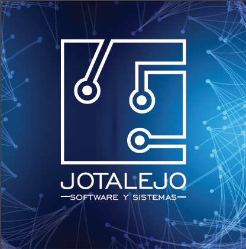

## PROJECT 0 - **FUNERAL SERVICES** - _Information for affiliate_
It is an application that will contain 4 modules.

### Module I ASSOCIATED CROSS
> Is the **cross of information** from 5 databases, corresponding to 5 companies in the  _cooperative  sector_
in which it is necessary to know if a certain _affiliate_ is in 1 or 2 or 3, etc. or in the 5 cooperatives
in order to generate the collection accounts for each of the cooperatives,  for example if it is in one,
then it must pay USD30 for that member, if it is in two cooperatives, it must pay USD $ 15 each,  if the
member is in 3 cooperatives,  then  each one must pay USD $ 10 for that member and so on. So the idea is
to calculate  the value to be paid  by each  cooperative and show a **~~summary~~** for each one to generate the
respective **charge account**.
<!-- headings is # ## and so -->
### Module II PLANS QUOTE
> We will provide a quotation for funeral expenses plans cover.

### Module III INCINERATOR OVEN
> We have the information management of a Solid Waste Incinerator Furnace.

### Module IV RISK MANAGEMENT
> The risk management of the company will be managed. Prudential standards regarding Anti-Money Laundering and Counter-Terrorism Financing (AML/CTF) risk management and other related provisions.

---
#### Developer
[jotalejo.com](http://www.jotalejo.com/ "developer page")

<!-- for code paste use : ' code ' or: several lines '''  block code   ''' -->
<!-- languaje: javacript, then use that word for show colors: '''javascript and then paste the code -->
<!-- also: html, python, etc -->

<!-- GITHUB MARKDOWN -->
* [x] Project 0

@jotalejo :smiley: :+1:

### Associated crosses 1/2 :
[Asso Cross 1/2](https://www.youtube.com/watch?v=4J9CTXRDyQo&list=PL5T_5recv-PKpefFTmjTlxQOC-ODds5ye&index=3&t=57s)

### Associated crosses 2/2 :
[Asso Cross 2/2](https://www.youtube.com/watch?v=ihEEsHLZ82c&list=PL5T_5recv-PKpefFTmjTlxQOC-ODds5ye&index=3)

